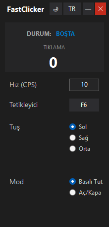
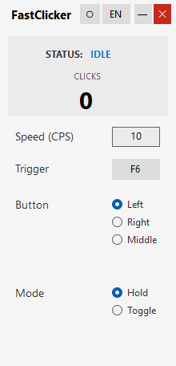

<div align="center">

# FastClicker




### Lightweight Auto Clicker for Windows

[](https://github.com/YusufEren97/FastClicker)
[](https://github.com/YusufEren97/FastClicker)
[](https://dotnet.microsoft.com/)
[](https://www.microsoft.com/windows)

**Only 27 KB. No installation required. Just download and run.**

[English](#features) • [Türkçe](#özellikler)

</div>

---

## Features

| Feature | Description |
|---------|-------------|
| Adjustable Speed | Set clicks per second (CPS) to any value |
| Mouse Buttons | Left, Right, and Middle button support |
| Two Modes | Hold (click while holding) or Toggle (press to start/stop) |
| Custom Trigger | Assign any key as the trigger (default: F6) |
| Theme Support | Dark and Light mode |
| Multi-Language | Turkish and English interface |
| Portable | Single 27 KB executable, no installation needed |

---

## Quick Start

1. [Download FastClicker.exe](Releases/FastClicker.exe) and run
2. Set your desired CPS value
3. Choose mouse button and mode
4. Press **F6** (or your custom trigger) to start clicking

> [!IMPORTANT]
> You may see a Windows SmartScreen warning when running. This is because the exe is unsigned, which is normal for independent developer projects. Click **"More info"** then **"Run anyway"**.

---

## Tech Stack

| Component | Technology |
|-----------|------------|
| **Language** | C# (.NET Framework 4.8) |
| **UI** | Windows Forms |
| **Native API** | user32.dll (mouse_event, GetAsyncKeyState) |

---

## Project Structure

```
FastClicker/
├── MainForm.cs              # Application logic
├── MainForm.Designer.cs     # UI layout
├── MainForm.resx            # Form resources
├── Program.cs               # Entry point
├── FastClicker.csproj       # Project file
├── FastClicker.sln          # Solution file
├── Screenshot/              # README images
│   ├── sc1.png
│   └── sc2.png
├── Releases/
│   └── FastClicker.exe      # Pre-built binary
└── README.md
```

---

## Build

```bash
git clone https://github.com/YusufEren97/FastClicker.git
cd FastClicker
dotnet build -c Release
```

Output: `bin\Release\net48\FastClicker.exe`

---

## Requirements

| Component | Requirement |
|-----------|-------------|
| **OS** | Windows 7 or later |
| **Runtime** | .NET Framework 4.8 (pre-installed on Windows 10/11) |

---

## License

This project is licensed under the **MIT License**.

---

<div align="center">

## Author

|  |
|:---:|
| **Yusuf Eren Seyrek** |
| [](https://github.com/YusufEren97) |

</div>

---

<a id="özellikler"></a>

## Türkçe

Windows için basit ve hafif bir otomatik tıklama uygulaması. Sadece 27 KB, kurulum gerektirmez.

### Özellikler

| Özellik | Açıklama |
|---------|----------|
| Ayarlanabilir Hız | Saniyedeki tıklama sayısını (CPS) belirleyin |
| Fare Tuşları | Sol, Sağ ve Orta tuş desteği |
| İki Mod | Basılı Tut veya Aç/Kapa |
| Özel Tetikleyici | Herhangi bir tuşu tetikleyici olarak atayın (varsayılan: F6) |
| Tema Desteği | Karanlık ve Aydınlık mod |
| Çift Dil | Türkçe ve İngilizce arayüz |
| Taşınabilir | Tek 27 KB dosya, kurulum gereksiz |

### Kullanım

1. [FastClicker.exe indir](Releases/FastClicker.exe) ve çalıştır
2. İstediğiniz CPS değerini girin
3. Fare tuşunu ve modu seçin
4. Tıklamayı başlatmak için **F6** tuşuna basın (veya belirlediğiniz tetikleyici)

> [!IMPORTANT]
> Çalıştırırken Windows SmartScreen uyarısı görebilirsiniz. Bu, exe dosyasının imzasız olmasından kaynaklanır ve bağımsız geliştirici projeleri için normaldir. **"Daha fazla bilgi"** ve ardından **"Yine de çalıştır"** seçeneklerine tıklayın.

### Derleme

```bash
git clone https://github.com/YusufEren97/FastClicker.git
cd FastClicker
dotnet build -c Release
```

Çıktı: `bin\Release\net48\FastClicker.exe`

### Gereksinimler

| Bileşen | Gereksinim |
|---------|------------|
| **İşletim Sistemi** | Windows 7 veya üstü |
| **Çalışma Zamanı** | .NET Framework 4.8 (Windows 10/11'de yüklü gelir) |

### Lisans

Bu proje **MIT Lisansı** altında yayınlanmıştır.
